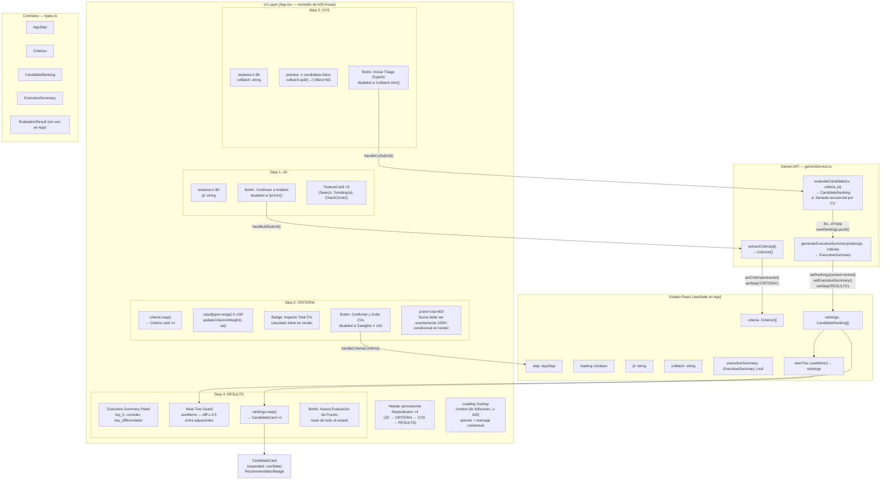

# TalentBridge CV Evaluator — Arquitectura y UX

> Documento de referencia para decisiones de rediseño. Basado en análisis de `src/App.tsx` (625 líneas) y `src/types.ts`.

---

## Diagrama de Arquitectura



---

## Tipos y Contratos

### `AppStep` (línea 35 de types.ts)

```ts
export type AppStep = 'JD' | 'CRITERIA' | 'CVS' | 'RESULTS';
```

**Propósito:** Máquina de estados lineal del wizard. Controla qué panel renderiza `AnimatePresence`. Estado central en `App`: `const [step, setStep] = useState<AppStep>('JD')`.

**Flujo:** Solo avanza hacia adelante excepto el botón "Regresar" en CRITERIA (vuelve a JD). No hay navegación libre entre steps.

---

### `Criterion` (líneas 1–6 de types.ts)

```ts
export interface Criterion {
  name: string;
  weight: number;           // 0–100, suma total debe = 100
  observable_signs: string; // texto libre, qué buscar en el CV
  degradation_signs: string; // texto libre, señales de alerta
}
```

**Propósito:** Rubrica de evaluación extraída por Gemini desde la JD. Generada en el Step JD, modificable en Step CRITERIA, consumida en Step CVS.

**Campos críticos:**
- `weight`: único campo editable por el usuario (slider). Validado en render (`criteria.reduce((acc, c) => acc + c.weight, 0) !== 100`) en la línea 61 y 66 de la porción CRITERIA.
- `observable_signs` / `degradation_signs`: desplegados en cards durante el Step CRITERIA; pasados a Gemini como contexto en `evaluateCandidate`.

**Flujo entre componentes:**
- Generada: `extractCriteria(jd)` → `setCriteria(extracted)` (línea 61 de App)
- Modificada: `updateCriterionWeight(i, val)` (líneas 100–104), mutación directa del array clonado
- Consumida: `evaluateCandidate(cv, criteria, jd)` en el loop de CVS

---

### `CandidateRanking` (líneas 8–17 de types.ts)

```ts
export interface CandidateRanking {
  rank?: number;            // asignado post-sort: .map((r, i) => ({ ...r, rank: i+1 }))
  name: string;
  score: number;            // 0.0–10.0, base del near-ties guard
  recommendation: 'AVANZAR' | 'CONSIDERAR' | 'RECHAZAR';
  evidence: string[];       // citas directas del CV
  strengths: string[];
  gaps: string[];
  red_flags: string[];
}
```

**Propósito:** Output de `evaluateCandidate` por candidato. Unidad de dato de `CandidateCard`.

**Campos críticos:**
- `score`: usado para ordenar (línea 89), calcular near-ties (línea 48), y mostrar en UI (`{candidate.score} / 10.0`).
- `recommendation`: determina el color de `RecommendationBadge` (emerald=AVANZAR, indigo=CONSIDERAR, slate=RECHAZAR) y el contador del resumen ejecutivo.
- `rank`: opcional en el tipo pero siempre presente en `rankings` porque se asigna en la misma operación sort+map.
- `evidence`: justificación auditable; visible en el `CandidateCard` expandido.

**Flujo:** `evaluateCandidate` → `newRankings[]` → sort+rank → `setRankings()` → `useMemo nearTies` + `CandidateCard`.

---

### `ExecutiveSummary` (líneas 19–24 de types.ts)

```ts
export interface ExecutiveSummary {
  top_3: string[];           // nombres, no objetos CandidateRanking
  consider: string[];        // nombres en categoría CONSIDERAR
  key_differentiator: string; // insight textual de Gemini
  total_evaluated: number;   // inyectado en App, no viene de Gemini
}
```

**Propósito:** Vista ejecutiva del batch. Generada por `generateExecutiveSummary(rankings, criteria)` y almacenada en `executiveSummary` state.

**Campos críticos:**
- `total_evaluated`: no lo retorna Gemini; se inyecta en App línea 90: `{ ...summary, total_evaluated: cvList.length }`. Riesgo: si Gemini falla mid-loop, `cvList.length` no refleja candidatos realmente evaluados.
- `top_3` y `consider`: son arrays de strings (nombres), no referencias tipadas a `CandidateRanking`. No hay validación de que esos nombres existan en `rankings`.

---

### `EvaluationResult` (líneas 26–33 de types.ts)

```ts
export interface EvaluationResult {
  job_description: string;
  profile_analysis: { criteria: Criterion[] };
  candidate_rankings: CandidateRanking[];
  executive_summary: ExecutiveSummary;
}
```

**Propósito:** Contrato completo de la evaluación. **Actualmente no se usa en App.tsx**. Es un artefacto de diseño (posiblemente residuo de una versión anterior o preparación para export/persistencia). No se importa ni se referencia en ningún componente.

---

## Análisis UX por Paso

### Step 1 — JD (Job Description)

**Entrada:** `textarea h-80` (320px) con placeholder genérico.

**Acción:** Un único botón "Continuar a Análisis de Perfil" dispara `handleJdSubmit()` → Gemini → loading overlay global.

**Elementos informativos:** 3 `FeatureCard` debajo del textarea explican el valor del producto (Análisis Profundo, Pesos Dinámicos, Evidencia Real).

**Fricciones:**
- El usuario no tiene feedback de cuántos caracteres/palabras tiene la JD. No hay mínimo explícito (solo `jd.trim()`).
- El loading overlay bloquea toda la UI con un spinner genérico. Si la JD es compleja y Gemini tarda, no hay indicador de progreso ni timeout.
- No hay persistencia: si el usuario recarga, pierde todo.
- Los `FeatureCard` ocupan espacio pero no ayudan al usuario a saber qué formato espera la JD.

---

### Step 2 — CRITERIA (Criterios de Evaluación)

**Entrada:** Lista de cards generadas por Gemini, cada una con slider de peso (0–100).

**Validación:** `Σweights === 100` requerido. Badge "Impacto Total: X%" actualiza en tiempo real. Botón deshabilitado + mensaje rose si la suma ≠ 100.

**Fricciones:**
- **Problema principal de UX:** Los sliders son independientes. Mover uno no ajusta los demás. Llegar exactamente a 100% con N sliders es una tarea cognitivamente costosa (suma en la cabeza + ajuste iterativo). No hay "normalizar automáticamente" ni "distribuir equitativamente".
- El mensaje de error aparece debajo del botón, fuera del campo visual natural cuando hay muchos criterios (scroll necesario).
- No hay forma de agregar o eliminar criterios. Si Gemini extrae uno irrelevante, no se puede borrar.
- No hay forma de editar el `name` del criterio si está mal extraído.
- El botón "Regresar" borra los criterios (vuelve al Step JD) sin confirmación.

---

### Step 3 — CVS (Lote de Candidatos)

**Entrada:** `textarea h-96` (384px). Separador `---`. Placeholder: `[CV 1: NOMBRE...]\n---\n[CV 2: NOMBRE...]`.

**Feedback previo al submit:** Counter en tiempo real: `n candidatos listos para análisis experto` (línea 99, calculado con el mismo split/filter que el procesamiento).

**Fricciones:**
- **El separador `---` es frágil.** CVs en formato Markdown tienen `---` como separador de sección YAML/HR. Un CV pegado de LinkedIn o un PDF exportado puede contener `---` internamente, partiendo un candidato en dos entradas.
- El filtro `c.length > 50` silencia CVs cortos sin advertencia al usuario.
- La evaluación es **secuencial** (`for...of` loop, líneas 82–85). Con 10 candidatos, si el 7mo falla, se pierden los 6 ya procesados porque el catch (línea 92) muestra un `alert` genérico y no hace rollback parcial ni permite reintentar desde el candidato fallido.
- No hay límite documentado de candidatos. Con 20+ CVs y evaluación secuencial, el tiempo de espera puede ser de varios minutos sin progreso granular.
- Si el usuario pega CVs con caracteres `---` en los guiones de experiencia laboral (`2020 --- 2022`), el split los partirá incorrectamente.

---

### Step 4 — RESULTS (Ranking Experto)

**Componentes:** Dashboard con Executive Summary (top_3, consider, key_differentiator), Near-Ties Guard, lista de `CandidateCard` expandibles, botón reset.

**CandidateCard:** Tiene estado local `expanded: boolean` con `motion.div layout`. Muestra score, `RecommendationBadge`, barra de progreso score, y al expandir: strengths, gaps, red_flags, evidence.

**Fricciones:**
- No hay exportación de resultados (PDF, CSV, JSON). El usuario debe copiar manualmente.
- El botón "Nueva Evaluación de Puesto" resetea **todo** el estado (líneas 228–233), incluyendo `jd` y `criteria`. Si el reclutador quiere re-evaluar con los mismos criterios y otra tanda de CVs, debe recomenzar desde cero.
- El Step RESULTS no renderiza si `executiveSummary` es null (condición: `step === 'RESULTS' && executiveSummary`). Si `generateExecutiveSummary` falla pero `evaluateCandidate` tuvo éxito, el usuario ve pantalla en blanco sin error visible.
- `StepIndicator` usa `isPast = steps.indexOf(step) > steps.indexOf(activeStep)` — la lógica está invertida (línea 250): `isPast` debería ser pasos que ya se completaron, pero el cálculo los marca como pasos que vienen después. Efecto: los steps anteriores al actual aparecen con `opacity-40` en lugar de mostrar estado completado.

---

## Puntos de Fricción

| # | Punto | Severidad | Componente / Línea |
|---|-------|-----------|-------------------|
| 1 | Separador `---` colisiona con Markdown HR y guiones en texto de CVs | Alta | `handleCvSubmit` línea 79 |
| 2 | Evaluación secuencial sin rollback parcial: error en candidato N pierde N-1 resultados | Alta | líneas 82–95 |
| 3 | `EvaluationResult` declarado pero nunca usado: deuda de diseño | Media | types.ts líneas 26–33 |
| 4 | `total_evaluated` inyectado con `cvList.length` no con candidatos realmente evaluados | Media | línea 90 |
| 5 | Near-ties evalúa pares adyacentes solo; no detecta clusters de 3+ candidatos empatados | Media | líneas 44–54 |
| 6 | `StepIndicator.isPast` lógica invertida: pasos futuros marcados como pasados | Baja/Media | línea 250 |
| 7 | Sliders de peso independientes sin auto-normalización | Alta UX | CRITERIA step, líneas 40–50 |
| 8 | Sin persistencia de sesión: recarga = pérdida total | Media | global state |
| 9 | Sin exportación de resultados | Media | RESULTS step |
| 10 | `executiveSummary === null` en RESULTS = pantalla en blanco silenciosa | Media | línea 114 |
| 11 | Límite mínimo de CV (`> 50` chars) silencioso, sin feedback al usuario | Baja | línea 79 |
| 12 | Error handling: solo `alert()` nativo, sin retry, sin mensaje contextual | Media | líneas 64, 94 |

---

## Propuestas de Mejora UX

### 1. Reemplazar separador `---` por delimitador inequívoco

**Problema (línea 79):** `cvBatch.split('---')` parte CVs que contienen guiones o separadores Markdown.

**Propuesta:** Usar `=====` (5 signos igual) o un token UUID único como `<<<CV_SEPARATOR>>>`. Alternativamente, ofrecer un botón "Agregar candidato" que añada secciones numeradas explícitas en el textarea, haciendo el separador un artefacto de la UI y no una convención del usuario.

```ts
// Propuesta: separador menos ambiguo
const cvList = cvBatch.split('=====').map(c => c.trim()).filter(c => c.length > 50);
```

---

### 2. Evaluación paralela con progreso granular

**Problema (líneas 82–85):** Loop `for...of` secuencial. Sin progreso visible. Error total ante fallo parcial.

**Propuesta:** Usar `Promise.allSettled` con un estado de progreso por candidato.

```ts
// Estado adicional
const [progress, setProgress] = useState<{ done: number; total: number }>({ done: 0, total: 0 });

// En handleCvSubmit:
setProgress({ done: 0, total: cvList.length });
const results = await Promise.allSettled(
  cvList.map(async (cv) => {
    const result = await evaluateCandidate(cv, criteria, jd);
    setProgress(p => ({ ...p, done: p.done + 1 }));
    return result;
  })
);
const successful = results
  .filter((r): r is PromiseFulfilledResult<CandidateRanking> => r.status === 'fulfilled')
  .map(r => r.value);
```

El loading overlay muestra `"Analizando candidato 3 de 8..."` en lugar del spinner estático.

---

### 3. Auto-normalización de pesos con "bloqueo de criterios"

**Problema:** Sumar exactamente 100% con sliders independientes es una tarea frustrante.

**Propuesta:** Agregar un checkbox "Bloquear" por criterio. Al mover un slider libre, los pesos de los criterios no bloqueados se redistribuyen proporcionalmente para mantener el total en 100%.

```ts
const updateCriterionWeightNormalized = (index: number, newWeight: number) => {
  const locked = criteria.map((_, i) => i === index || lockedCriteria.has(i));
  const freeIndices = criteria.map((_, i) => i).filter(i => !locked[i] && i !== index);
  const remaining = 100 - newWeight - criteria
    .filter((_, i) => locked[i] && i !== index)
    .reduce((s, c) => s + c.weight, 0);
  // distribuir `remaining` proporcionalmente entre freeIndices
};
```

---

### 4. Mejorar el Near-Ties Guard

**Problema actual (líneas 44–54):** Solo detecta empates entre pares adyacentes. Si tres candidatos tienen scores `7.5, 7.2, 7.0`, detecta (7.5,7.2) y (7.2,7.0) pero no comunica que los tres forman un cluster.

**Propuesta 1 — Detección de clusters:**

```ts
const nearTieGroups = useMemo(() => {
  const sorted = [...rankings].sort((a, b) => b.score - a.score);
  const groups: CandidateRanking[][] = [];
  let currentGroup: CandidateRanking[] = [sorted[0]];
  for (let i = 1; i < sorted.length; i++) {
    if (sorted[i - 1].score - sorted[i].score <= 0.5) {
      currentGroup.push(sorted[i]);
    } else {
      if (currentGroup.length > 1) groups.push(currentGroup);
      currentGroup = [sorted[i]];
    }
  }
  if (currentGroup.length > 1) groups.push(currentGroup);
  return groups;
}, [rankings]);
```

**Propuesta 2 — Umbral configurable:** Exponer el threshold (actualmente hardcoded `0.5`) como una constante nombrada `NEAR_TIE_THRESHOLD = 0.5` para facilitar ajuste futuro.

**Propuesta 3 — Acción accionable:** Cuando hay near-ties, ofrecer un botón "Solicitar desempate" que genere un prompt adicional a Gemini pidiendo un criterio de desempate basado en los campos `red_flags` y `strengths` de los candidatos empatados.

---

### 5. Corregir lógica de `StepIndicator`

**Problema (línea 250):** `isPast = steps.indexOf(step) > steps.indexOf(activeStep)` — `step` es el step que se está evaluando y `activeStep` es el paso actual. La condición marca como "past" los pasos que vienen después del actual, no antes.

**Corrección:**

```ts
// Línea 250 actual (incorrecto):
const isPast = steps.indexOf(step) > steps.indexOf(activeStep);

// Corrección:
const isCompleted = steps.indexOf(activeStep) > steps.indexOf(step);
```

Renombrar la variable a `isCompleted` y aplicar el estilo correspondiente (checkmark verde, no opacity-40).

---

### 6. Separar exportación y persistencia

**Propuesta de exportación rápida en RESULTS:**

```tsx
const exportJSON = () => {
  const data: EvaluationResult = {  // Finalmente usar EvaluationResult
    job_description: jd,
    profile_analysis: { criteria },
    candidate_rankings: rankings,
    executive_summary: executiveSummary!,
  };
  const blob = new Blob([JSON.stringify(data, null, 2)], { type: 'application/json' });
  const url = URL.createObjectURL(blob);
  const a = document.createElement('a');
  a.href = url;
  a.download = `talentbridge-${Date.now()}.json`;
  a.click();
};
```

Esto también resuelve el punto de `EvaluationResult` siendo un tipo declarado pero sin uso (Fricción #3).

---

### 7. Error handling contextual

**Problema:** `alert()` nativo (líneas 65 y 94) interrumpe la UI y no ofrece retry.

**Propuesta:** Estado `error: string | null` que renderiza un banner inline con botón de reintento, sin abandonar el step actual:

```ts
const [error, setError] = useState<string | null>(null);

// En el catch:
setError('No se pudo conectar con Gemini. Verifica tu API key y reintenta.');

// En el JSX del step:
{error && (
  <div className="p-4 bg-rose-50 border border-rose-200 rounded-xl flex justify-between items-center">
    <p className="text-rose-700 text-sm font-medium">{error}</p>
    <button onClick={() => { setError(null); handleCvSubmit(); }}>Reintentar</button>
  </div>
)}
```

---

*Generado el 2026-05-09. Fuente: análisis de `src/App.tsx` y `src/types.ts`.*
